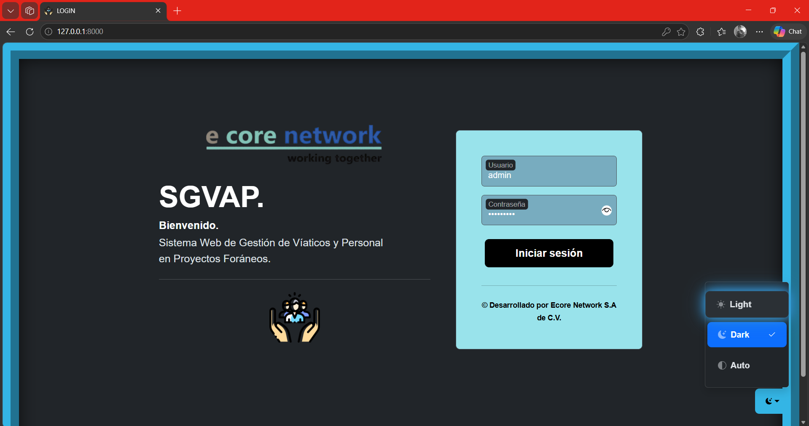
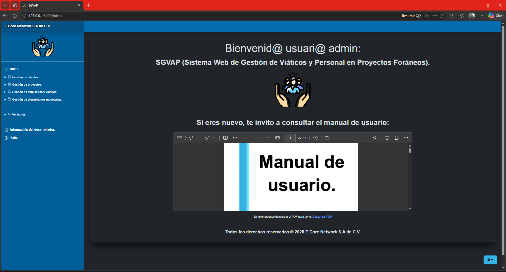

# SGVAP - Sistema Web para la Gestión de Viáticos y Personal en Proyectos Foráneos

Sistema web integral desarrollado para la administración de viáticos, gestión de personal y control de recursos en proyectos foráneos. Permite centralizar y automatizar procesos que comúnmente se gestionan de forma manual mediante hojas de cálculo, mejorando la eficiencia operativa y reduciendo errores.

---

## Objetivo

Desarrollar una solución web que permita gestionar clientes, proyectos, empleados, viáticos, dispersiones monetarias y vehículos, proporcionando herramientas de análisis, reportes y control administrativo en un entorno centralizado.

---

## Tecnologías utilizadas

### Backend

* PHP
* Laravel
* Programación Orientada a Objetos (POO)
* Eloquent ORM
* Middlewares
* Stored Procedures
* Form Request

### Frontend

* HTML5
* CSS3
* JavaScript
* Bootstrap
* Blade (Motor de plantillas)

### Base de datos

* MySQL
* Migraciones
* Seeders
* Model Factories

### Herramientas y entorno

* Composer
* XAMPP
* Visual Studio Code
* PHPUnit (pruebas)
* JSON
* HTTPS (TLS 1.3)

---

## Funcionalidades principales

### Gestión de clientes

* Registro de clientes
* Consulta y actualización de clientes

### Gestión de proyectos

* Creación, actualización y consulta de proyectos

### Gestión de empleados

* Registro de empleados internos y contratistas
* Clasificación por tipo (interno | contratista)
* Control de estado (activo | no activo)

### Gestión de viáticos

* Registro de cortes diarios y mensuales
* Cálculo automático de viáticos semanales y anuales
* Gestión de deudas adicionales

### Dispersiones monetarias

* Gestión de gasolina, casetas y hospedajes (CRUD)
* Procesamiento automático de archivos `.xls` o  `.xlsx`

### Gestión de vehículos

* Registro y administración de vehículos
* Control de estado (funcional | mantenimiento)
* Gestión de préstamos vehiculares a empleados

### Reportes y visualización

* Gráficas de barras (viáticos por empleado/proyecto)
* Gráficas de pastel (distribución de viáticos)
* Barras de progreso sobre presupuestos en viáticos y tiempo
* Generación de reportes en PDF:

  * Estado de proyectos concluidos
  * Préstamos vehiculares finalizados

---

## Capturas del sistema

### Autenticación
<p align="center">
  
</p>

### Dashboard
<p align="center">
  
  &nbsp;&nbsp;&nbsp;
  
</p>

### Gestión de proyectos

### Gestión de empleados

### Gestión de clientes

### Gestión de viáticos

### Dispersiones monetarias

### Gestión de vehículos

### Reportes y gráficas

### Autor
<p align="center">
  
</p>

---


## Requerimientos no funcionales

* **Rendimiento:** tiempo de respuesta menor a 2 segundos en operaciones comunes
* **Disponibilidad:** acceso continuo en entorno local con disponibilidad mínima del 95%
* **Usabilidad:** interfaz clara, navegación estructurada y validación en formularios
* **Portabilidad:** compatible con navegadores modernos
* **Adaptabilidad:** diseño responsivo (Flexbox y Grid)
* **Seguridad:** autenticación de usuario administrador, implementación de HTTPS con TLS 1.3, protección contra:

  * Inyecciones SQL (Eloquent ORM)
  * XSS (escape en Blade)
  * CSRF (tokens de seguridad)

---

## Instalación

1. Clonar el repositorio

```bash
git clone https://github.com/HarritoT1/sgvap_vs_1_0.git
```

2. Instalar dependencias

```bash
composer install
npm install
```

3. Configurar entorno

```bash
cp .env.example .env
```

4. Generar clave de aplicación

```bash
php artisan key:generate
```

5. Configurar base de datos en `.env`

6. Ejecutar migraciones y seeders

```bash
php artisan migrate --seed
```

7. Ejecutar servidor

```bash
php artisan serve
```

---

## Uso del sistema

Flujo básico de operación:

1. Inicio de sesión como administrador
2. Registro de clientes, proyectos y empleados
3. Asignación y control de viáticos
4. Registro de dispersiones (gasolina, casetas, hospedaje)
5. Gestión de vehículos y préstamos
6. Generación de reportes y análisis gráfico

---

## Base de datos

* Motor: MySQL
* Convención: nombres en inglés y en plural
* Relaciones:
	
  * Clientes  ↔ Proyectos
  * Proyectos ↔ Empleados
  * Empleados ↔ Viáticos
  * Vehículos ↔ Préstamos

Incluye uso de migraciones, seeders y procedimientos almacenados.

---

## Arquitectura

El sistema está desarrollado bajo el patrón MVC (Modelo-Vista-Controlador), utilizando Laravel como framework principal, lo que permite una separación clara de responsabilidades, facilitando el mantenimiento y escalabilidad del sistema.

---

## Estado del proyecto

Proyecto funcional y testeado, desarrollado como parte de formación profesional para la empresa E Core Network S. A. de C.V., operando en entorno local mediante XAMPP.

---

## Entregables

* Documento de requerimientos
* Diagramas UML 
* Prototipo en Figma
* Script SQL inicial
* Bitácora de pruebas
* Sistema funcional
* Manual de usuario
* Reporte técnico

---

## Autor

Desarrollado por Ing. Harol Gael Cardenas Trejo
Ingeniería en Sistemas Computacionales
